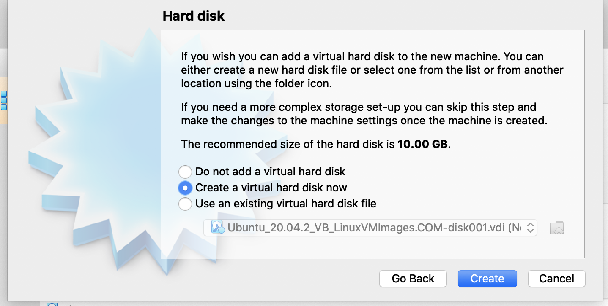

# **Deploying a Virtual Machine to VirtualBox**

Course: DevOps

Mod: Week 1

Topic: Deploying a Virtual Machine to VirtualBox

Amount of time: 1.5 hours

Author: Thomas Fowler

## **Lesson Objectives**

* Understand the process of creating a new virtual machine
from scratch.

* Describe the process by which you deploy a virtual machine
on VirtualBox.

* Understand the various levels of customization and
configuration of virtual machines on VirtualBox.

--------------------------------------------

## **Virtual Machine Fundamentals**

Using VirtualBox there are a few different ways to create a new
virtual machine. The simplest way is using the **_"Machine" ->
"New..."_** option under the VirtualBox manager window.
(See Fig. 1)

--------------------------------------------

 [Fig. 1]

--------------------------------------------

### **Guest OS Selection**

The first step asks for a user-friendly name for the virtual
machine, a location on the host operating system, the type of
guest operating system for the virtual machine, and the version
of the guest operating system selected in the previous step.
(See Fig. 2)

--------------------------------------------

 [Fig. 2]

--------------------------------------------

There are several different operating systems supported. If an
operating system does not appear in the list, the type of
"Other" may be specified.

--------------------------------------------

### **Specify Memory Size**

Next, the wizard asks for the amount of memory to allocate
toward the virtual machine. (See Fig. 3)

--------------------------------------------

 [Fig. 3]

--------------------------------------------

This value can be any size that is less than the total amount
of available system memory on the host operating system. Setting
this value too high, however, can cause poor performance on the
host operating system and the other applications and services
it may run.

### **Virtual Hard Disk**

For the virtual machine's storage the wizard asks to specify
a virtual hard disk and its size. The recommended size is 10GB,
and this can be increased or decreased as needed. (See Fig. 4)

 [Fig. 4]

--------------------------------------------

### **Virtual Hard Disk Types**

There are three different types of virtual hard disk to choose
from in VirtualBox (See Fig. 5):

* VirtualBox Disk Image (VDI)
* Virtual Hard Disk (VHD)
* Virtual Machine Disk (VMDK)

 [Fig. 5]

Each of these options serves the same purpose but their
implementation differs slightly.

* VDI uses Oracle's proprietary container format to isolate
the volume for the virtual machine. This format is optimized
for VirtualBox and may be more performant. While more
performant it is not portable unless going to another
VirtualBox environment.

* VHD is the Microsoft version of a virtual hard disk and may
be ported to other Microsoft hypervisor environments.

* A VMDK is a virtual hard disk based on the open container
format of the same name and is from VMWare. This format is the
most portable and flexible if moving virtual machines from one
hypervisor to another.

--------------------------------------------

### **Virtual Hard Disk Storage Types**

Next the step in the wizard asks if the virtual hard disk
is fixed or dynamic. If dynamic is specified, the virtual
hard disk only takes up as much space as needed by its
contents. Conversely, a fixed virtual hard disk takes up as
much space as the user specifies.

While a dynamic VHD takes up less space initially, space is
not reclaimed if files, etc. are removed from the virtual hard
disk. Additionally, they are less performant than fixed VHDs
and may end up taking up as much space.

Fixed drives are static in terms of space and are recommended
if the VM is to have any amount of longevity on the host
environment. As stated previously, fixed VHDs outperform dynamic
VHDs but take up more space initially.

### **Lab Excercise 1**

* Deploy an Ubuntu virtual machine using VirtualBox

* Experiment with various settings and note observations

* Configure the virtual machine to allow external traffic using
port forwarding on the VM's primary network adapter.
